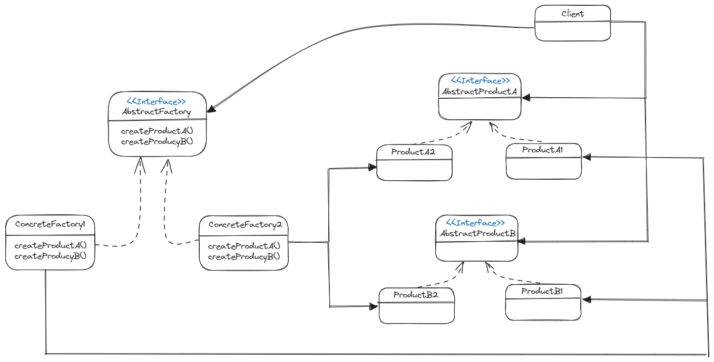

# 추상 팩토리 패턴 - Abstract Factory Pattern

> **💡 추상 팩토리 패턴은 구상 클래스에 의존하지 않고도 서로 연관되거나 의존적인 객체로 이루어진 _제품군_ 을
> 생산하는 인터페이스를 제공한다. 구상 클래스는 서브클래스에서 만든다.**

### 🔨 추상 팩토리 구조

* **AbstractFactory**
  * 실제 팩토리 클래스의 공통 인터페이스

* **ConcreteFactory**
  * 구체적인 팩토리 클래스. AbstractFactory 클래스의 추상 메서드를 오버라이드하여 구체적인 제품을 생성한다.

* **AbstractProduct**
  * 제품의 공통 인터페이스

* **ConcreteProduct**
  * ConcreteFactory 에서 생성되는 구체적인 제품

### 🎯 추상 팩토리 패턴의 목적

* 팩토리에서 인스턴스를 만들어 사용하는 Client 코드를 인터페이스 기반으로 사용할 수 있도록 도와주도록 하는 것을 목적으로 둔다.
* 애플리케이션의 구상 클래스 의존성을 줄여줌으로써 느슨한 결합을 만들기 위해서 사용한다. (팩토리 메서드 패턴과 동일)
* 클라이언트에서 서로 연관된 일련의 제품을 만들어야할 때, 즉 제품군을 만들어야할 때 사용한다.

### ⚖️ 추상 팩토리 패턴 VS 팩토리 메서드 패턴

* **팩토리 메서드 패턴**
  * 조건에 따른 객체 생성을 팩토리 클래스로 위임하여 팩토리 클래스에서 객체를 생성하는 패턴
  * 클래스를 사용하여 제품을 만든다.

* **추상 팩토리 패턴**
  * 서로 관련이 있는 객체들을 통째로 묶어서 팩토리 클래스로 만들고, 이러한 팩토리를 조건에 따라 생성하도록 다시 팩토리를 만들어서
객체를 생성하는 패턴
  * 객체를 사용하여 제품을 만든다.

> _추상 팩토리 패턴은 팩토리 메소드를 한번 더 추상 팩토리로 묶은 후, 어떤 클래스를 구현할 것인지 클라이언트 코드에서
> 주입하여 구체적인 클래스의 의존성을 최대한 제거한 구조다._
> 
> 따라서 추상 팩토리 패턴에서 제품을 생산하는 메소드를 구현하는 데 있어서 팩토리 메서드를 사용하는 것이 자연스럽게 따라온다.

