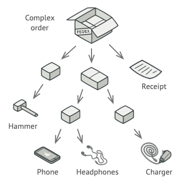

# Composite Pattern
> Composite 패턴은 부분과 전체의 계층을 표현하기 위해 객체들을 모아 트리구조로 구성합니다.   
> Client로 하여금 개별 객체와 복합 객체를 모두 동일하게 다룰 수 있도록 해주는 디자인 패턴입니다. 

## 예시로 알아보는 Composite Pattern  
### 문제상황
   
상자안에 또 다른 작은 상자와 배송물품들이 들어있습니다. 배송 물품들의 총 금액을 산정하려고 합니다.   
이럴 때 어떻게 게산을 할 수 있을까요?   
직접 물품들을 하나씩 참조하여 금액을 더해나갈 수 있을 것입니다.  
❗ 실세계에서는 충분히 가능한 일이지만, 프로그램에서는 간단하지 않습니다.  
어떻게 해결할 수 있을까요?

### 해결책
박스에 해당하는 작은 박스들은 `Box` 라는 인터페이스로, 물품들은 `Product`라는 인터페이스로 정의를 합니다.  
`상자`의 경우 상자에 포함된 각 항목들을 살펴보고 가격을 물은 뒤 상자에 대한 합계 금액을 반환합니다.   
`물품`의 경우 물품에 대한 금액을 반환합니다.  
이러한 식으로 프로그램을 처리할 수 있을 것입니다.  
이렇게 함으로써, 객체의 구체적인 클래스에 신경을 쓸 필요가 없어집니다.

## Composite 패턴의 구조 

#### Component
- 집합 관계에 정의될 모든 객체에 대한 인터페이스를 정의 
- 공통의 행동 (operation())을 구현
#### Leaf
- 자식이 없는 객체들을 나타냄. 
- 객체 합성에 기본이 되는 객체의 행동을 정의
#### Composite
- 자식이 있는 구성요소에 대한 행동을 정의 
- 자신의 자식들을 저장하며, Component에 정의된 자식 관련 연산을 구현

## Composite 패턴의 활용 
- 부분 - 전체의 객체 계통을 표현하고 싶을 때 사용 
- 복합 객체와 개개의 객체 사이의 차이를 나타내고 싶지 않을 때
  - 복합 객체 : 객체의 합성으로 생긴 객체 

## Composite 패턴의 장점 및 단점 
#### 장점 
- 복잡한 트리 구조를 편리하게 사용할 수 있다. 
- 다형성과 재귀를 활용할 수 있다. 
- 클라이언트의 코드를 변경하지 않고 새로운 Element 타입을 추가할 수 있다.

#### 단점 
- 공통된 인터페이스를 정의해야하기 때문에 지나친 일반화를 해야하는 상황이 생긴다. 
