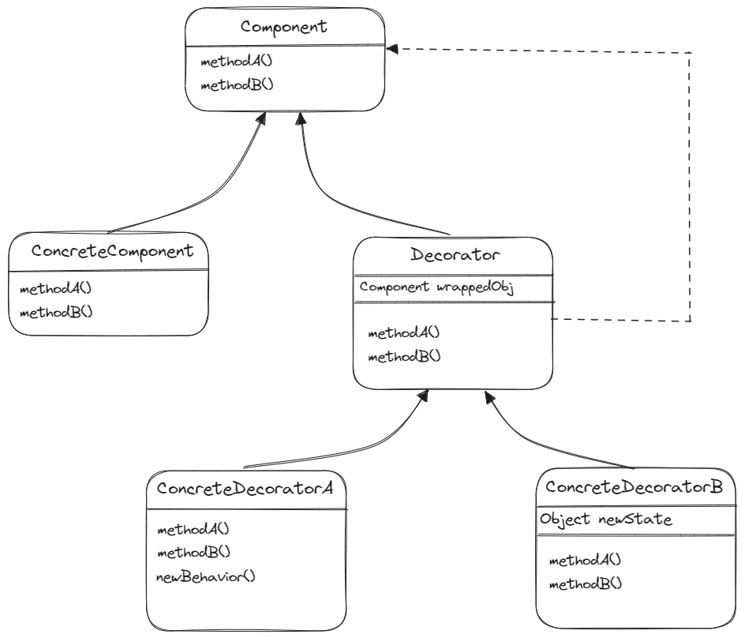

# 데코레이터 패턴 - Decorator Pattern

> **💡 데코레이터 패턴으로 객체에 추가 요소를 동적으로 더할 수 있다. 데코레이터를 사용하면 서브클래스를 만들 때보다 훨씬
> 유연하게 기능을 확장할 수 있다.**

## 🔨 데코레이터 구조

* **ConcreteComponent**
  * Decorator 를 이용하여 ConcreteComponent 에 새로운 행동을 동적으로 추가한다(데코레이팅 할 객체). 

* **Decorator**
  * 각 Decorator 안에는 Component 객체가 들어있다. 즉, 데코레이터는 구성 요소의 레퍼런스를 포함한 인스턴스 변수가 있다.
  * Decorator 는 자신이 장식할 구성 요소와 같은 인터페이스 또는 추상 클래스를 구현한다.
  

* **ConcreteDecorator**
  * ConcreteDecorator 는 Decorator 가 감싸고 있는 Component 객체용 인스턴스 변수가 있다.
  * Component 의 상태를 확장할 수도 있다.
  * 새로운 메소드를 추가할 수도 있다. 일반적으로는 새로운 메소드를 추가하는 대신 Component 에 원래 있던 메소드를 별도의
작업으로 처리해서 새로운 기능을 추가한다.
  

---

## 🎯 데코레이터 패턴 사용 시기

* 상속을 통해 서브클래싱으로 객체의 동작을 확장하는 것이 어색하거나 불가능 할 때
* 객체 책임과 행동이 동적으로 상황에 따라 다양한 기능이 빈번하게 추가/삭제되는 경우
* 객체를 사용하는 코드를 손상시키지 않고 런타임에 객체에 추가 동작을 할당할 수 있어야 하는 경우

---

## 📝 데코레이터 패턴의 장단점

### 장점
* 상속없이 클래스의 기능을 확장할 수 있다.
* 유연성이 높으며 확장시 코드 수정없이 Decorator 클래스를 추가하면되니 OCP를 만족하는 디자인 패턴이다.
* 객체를 여러 데코레이터로 래핑하여 여러 동작을 결합할 수 있다.
* 컴파일 타임이 아닌 런타임에 동적으로 기능을 변경할 수 있다.

### 단점
* 자잘한 객체가 매우 많이 추가될 수 있고, 데코레이터를 너무 많이 사용하면 코드가 필요 이상으로 복잡해진다.
* 구성 요소를 초기화하는 데 필요한 코드가 훨씬 복잡해진다.
* Wrapper 스택에서 특정 Wrapper 를 제거하는 것은 어렵다.

---
**_출처_**

[Refactoring Guru](https://refactoring.guru/ko/design-patterns/decorator)

헤드퍼스트 디자인패턴