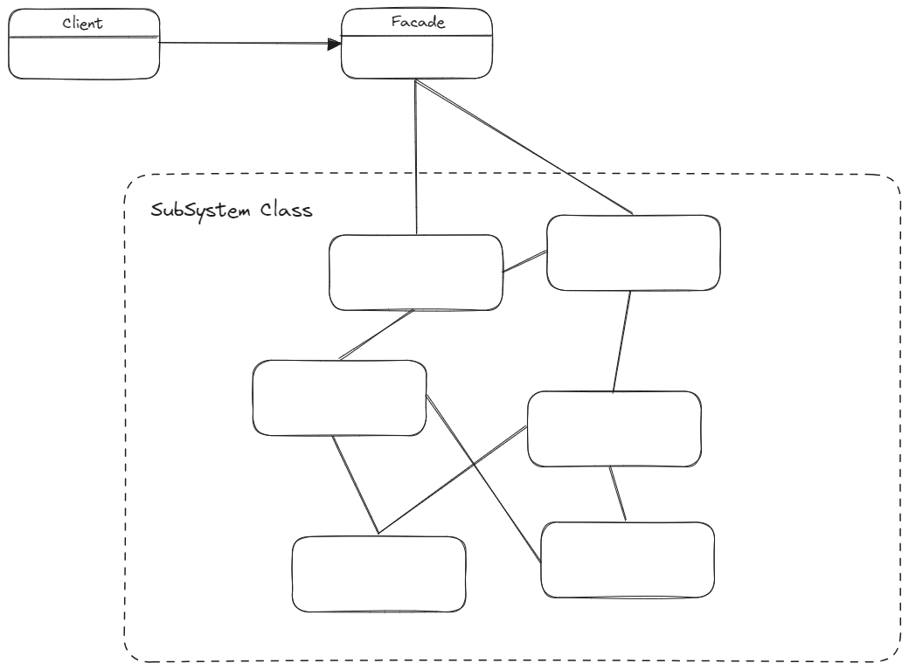

# 퍼사드 패턴 - Facade Pattern

> **💡 퍼사드 패턴(Facade Pattern)은 서브시스템에 있는 일련의 인터페이스를 통합 인터페이스로 묶어준다. 또한 고수준 인터페이스도 정의하므로
> 서브시스템을 더 편리하게 사용할 수 있다. 즉, 복잡한 집합에 대한 단순화된 인터페이스를 제공하는 구조적 디자인 패턴이다.**
> 
> _Facade_: 건물의 외벽

## 🔨 퍼사드 구조

* **Client**
  * 클라이언트는 하위 시스템 객체들을 직접 호출하지 않고 퍼사드를 사용한다.
  * 클라이언트에 퍼사드가 주어지므로 직접 구성 요소를 생성하지 않아도 된다.

* **Facade**
  * 클라이언트의 요청을 어디로 보내야 하는지와 움직이는 모든 부품을 어떻게 작동해야 하는지 알고있다.
  * 서브시스템으로 퍼사드를 만들고 진짜 작업은 서브클래스에 맡긴다.
  * 한 서브시스템에 여러개의 퍼사드가 존재할 수 있다.

* **SubSystem**
  * 복잡하게 수십개의 다양한 객체들로 이루어져 있다.
  * SubSystem 클래스들은 퍼사드의 존재를 인식하지 못한다. 이들은 시스템 내에서 작동하고, 매개체 없이 직접 서로와 작업한다.

---

## 🎯 퍼사드 패턴 사용 시기
* 복잡한 시스템을 간단하게 접근할 수 있도록 만들고 싶을때
* 시스템을 사용하고 있는 외부와 결합도가 너무 높아 의존성을 낮추기 위해서

---

## 📝 퍼사드 패턴의 장단점

### 장점
1. 클라이언트를 복잡한 서브 시스템과 분리한다.
2. 클라이언트는 서브 시스템들의 코드를 몰라도 되고 Facade 클래스만 이해하고 사용하면 된다.
3. 서브 시스템 간의 결합도를 낮춘다. 매개체 역할을 해주는 퍼사드 객체가 있기 때문이다.

### 단점
1. 퍼사드 클래스 자체가 서브 시스템에 대한 의존성을 가지게 되어 의존성을 완전히 피할 수는 없다.
2. 퍼사드는 모든 클래스에 결합된 God Object 가 될 수 있다.

---
**_출처_**

[Refactoring Guru](https://refactoring.guru/design-patterns/proxy)

헤드퍼스트 디자인패턴