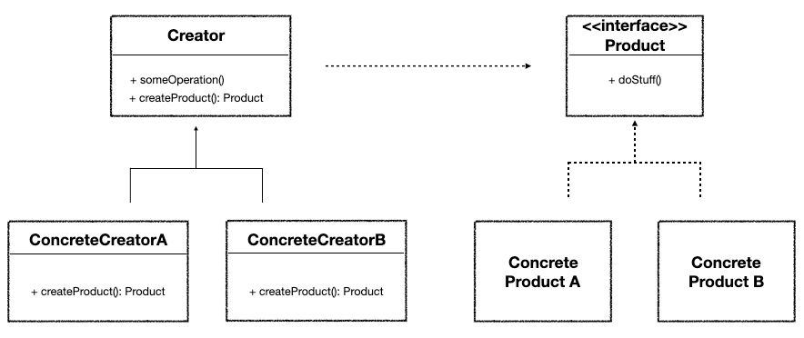

# 팩토리 메서드 패턴 (FACTORY METHOD)
<hr>

## 의도 
> 객체를 생성하기 위해 인터페이스를 정의하지만, 어떤 클래스의 인스턴스를 생성할 지에 대한 결정은 서브클래스가 내리도록 한다. 

## 활용성 
1. 어떤 클래스가 자신이 생성해야 하는 객체의 클래스를 예측할 수 없을 때
2. 생성할 객체를 기술하는 책임을 자신의 서브클래스가 지정했으면 할 때 
3. 객체 생성의 책임을 몇 개의 보조 서브클래스 가운데 하나에게 위임하고, 어떤 서브클래스가 위임자인지에 대한 정보를 국소화시키고 싶을 때 

## 구조 


[Creator]
- Product 타입의 객체를 반환하는 팩토리 메서드를 선언합니다.
- createProduct() 메서드를 통해 Product를 생성합니다. 
- Concrete Product 생성의 책임은 Concrete Creator에게 위임합니다. 

[Concrete Creator]
- Concrete Product의 인스턴스를 반환합니다. 

[Product]
- 팩토리 메서드가 생성하는 객체의 인터페이스를 정의합니다. 

[Concrete Product]
- Product 클래스에 정의된 인터페이슬르 실제로 구현합니다. 


## 예시 
자동차 제조와 관련된 서비스를 개발한다고 가정하겠습니다.  
경차, 중형차, 대형차를 생성할 수 있습니다.   
공장에서는 주문이 들어왔을 때 그에 맞는 차를 생성합니다.

### `Factory Method 적용 전`
[CarFactory.java](..%2Fsrc%2Fmain%2Fjava%2Ffactorymethod%2Fbefore%2FCarFactory.java)
```java
public class CarFactory {

    public static Car createCar(String size, String phoneNumber) {

        // validation
        if (size == null || size.isBlank()) {
            throw new IllegalArgumentException("차량 크기를 입력해주세요");
        }
        if (phoneNumber == null || phoneNumber.isBlank()) {
            throw new IllegalArgumentException("연락처를 남겨주세요");
        }

        Car car = new Car();

        // 만약 팩토리 메서드의 상세 스펙이 바뀌면 해당 코드가 변경 되어야 한다. => OCP위반 
        if (size.equals("small")) {
            car.setSize("small");
            car.setWeight(1000);    // 1 ton
        } else if (size.equals("medium")) {
            car.setSize("medium");
            car.setWeight(5000);    // 5 ton
        } else {
            car.setSize("large");
            car.setWeight(10000);   // 10 ton
        }

        // notify
        System.out.println("전화번호 : " + phoneNumber + " | 문자 전송 완료");

        return car;
    }
}

```
### `Factory Method 적용 후`
[CarFactory.java](..%2Fsrc%2Fmain%2Fjava%2Ffactorymethod%2Fafter%2Ffactory%2FCarFactory.java)
```java
public interface CarFactory {

    default Car createCar(String phoneNumber) {
        validate(phoneNumber);
        Car car = makeCar();
        notify(phoneNumber);
        return car;
    }

    private static void validate(String phoneNumber) {
        if (phoneNumber == null || phoneNumber.isBlank()) {
            throw new IllegalArgumentException("연락처를 남겨주세요");
        }
    }

    Car makeCar();  // 생성의 책임을 하위 클래스에게 넘김

    private static void notify(String phoneNumber) {
        System.out.println("전화번호 : " + phoneNumber + " | 문자 전송 완료");
    }
}

// --- // 
// 새로운 상세 스펙이 생길 경우 새로운 Factory를 생성해 주면 됨 => OCP 준수
public class LargeCarFactory implements CarFactory{
    @Override
    public Car makeCar() {
        return new LargeCar();
    }
}
```

## 장점 및 단점
[장점]
- OCP를 준수하며 개발이 가능하다. 
- Product와 Creator 간 coupling을 loose하게 가져갈 수 있다. 

[단점]
- 팩토리 메서드 적용 전보다 구현해야하는 클래스가 많아진다.  


