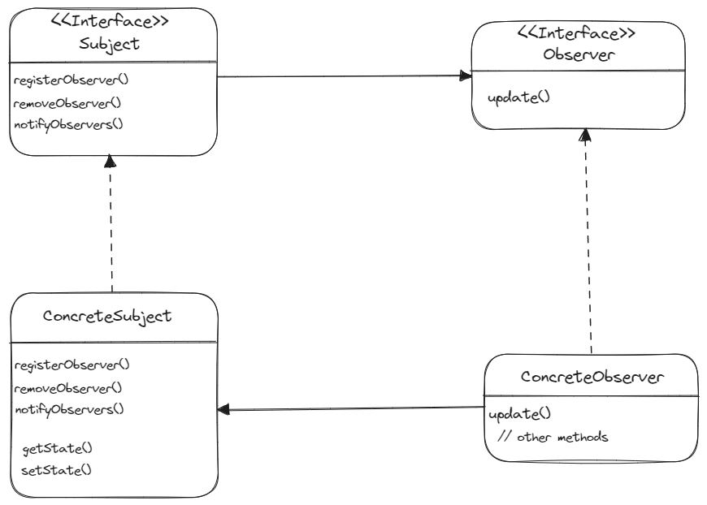

# 옵저버 패턴 - Template Method Pattern

> **💡 옵저버 패턴은 한 객체의 상태가 바뀌면 그 객체에 의존하는 다른 객체에게 연락이 가고 자동으로 갱신되는 방식으로
> 일대다(one-to-many) 의존성을 정의한다.**

## 🔨 옵저버 구조

* **Subject, Concrete Subject**
  * 주제를 나타내는 Subject 인터페이스이다.
  * 객체에서 옵저버로 등록하거나 옵저버 목록에서 탈퇴하고 싶을 때 이 인터페이스에 있는 메소드를 사용한다.
  * 주제 역할을 하는 구상 클래스에는 항상 Subject 인터페이스를 구현해야 한다.
  * 상태가 바뀔 때마다 모든 옵저버에게 연락하는 `notifyObservers()` 메소드도 구현해야 한다.

* **Observer, ConcreteObserver**
  * 옵저버가 될 가능성이 있는 객체는 반드시 Observer 인터페이스를 구현해야 한다. 이 인터페이스는 주제의 상태가 바뀌었을 때 호출되는 `update()`
메소드밖에 없다.
  * Observer 인터페이스만 구현한다면 무엇이든 옵저버 클래스가 될 수 있다.
---

## 🎯 옵저버 패턴 사용 시기
* 한 객체의 상태가 변경되면 다른 객체도 변경해야 할때. 그런데 어떤 객체들이 변경되어야 하는지 몰라도 될 때

* 앱이 한정된 시간, 특정한 케이스에만 다른 객체를 관찰해야 하는 경우

* 대상 객체의 상태가 변경될 때마다 다른 객체의 동작을 트리거해야 할때

---

## 📝 옵저버 패턴의 장단점

### 장점
* Subject의 상태 변경을 주기적으로 조회하지 않고 자동으로 감지할 수 있다.
* 상태를 변경하는 객체(Subject)와 변경을 감지하는 객체(Observer)의 관계를 느슨하게 유지할 수 있다. (느슨한 결합)

### 단점
* 구독자는 알림 순서를 제어할수 없고, 무작위 순서로 알림을 받는다.
* 너무 많이 사용할 경우 상태 관리가 힘들 수 있다.
---
**_출처_**

[Refactoring Guru](https://refactoring.guru/design-patterns/observer)

헤드퍼스트 디자인패턴