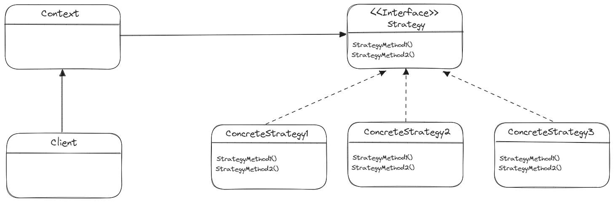

# 전력 패턴 - Strategy Pattern

> **💡 전략 패턴이란, 비슷한 동작을 하지만 다르게 구현되어 있는 행위(전략)들을 공통의 인터페이스를 구현하는 각각의 
> 클래스로 구현하고, 동적으로 바꿀 수 있도록 하는 패턴이다. 전략 패턴으로 구현된 코드는 직접 행위에 
> 대한 코드를 수정할 필요 없이 전략만 변경하여 유연하게 확장할 수 있게 된다.**

## 🔨 전략 패턴 구조

* **Context**
  * 알고리즘을 실행해야 할 때마다 해당 알고리즘과 연결된 전략 객체의 메소드를 호출한다.

* **Client**
  * 특정 전략 객체를 컨텍스트에 전달 함으로써 전략을 등록하거나 변경하여 전략 알고리즘을 실행한 결과를 누린다.

* **Strategy**
  * 인터페이스는 모든 구상 전략에 공통이며, 콘텍스트가 전략을 실행하는 데 사용하는 메소드를 선언한다.
  * ConcreteStrategy 는 콘텍스트가 사용하는 알고리즘의 다양한 변형들을 구현한다.

---

## 🎯 전략 패턴 사용 시기
* 모든 코드가 비슷한 기능을 수행하는 경우 사용해볼 수 있다.

* 완벽히 동일한 기능을 수행하지만, 요구 성능에 따라 다른 알고리즘을 선택해야할 경우에도 사용해볼 수 있다.

---

## 📝 전략 패턴 vs 템플릿 메소드
* 전략 패턴은 합성(composition)을 통해 해결책을 강구하며, 템플릿 메서드 패턴은 상속(inheritance)을 통해 해결책을 제시한다.

* 전략 패턴은 클라이언트와 객체 간의 결합이 느슨한 반면, 템플릿 메서드 패턴에서는 두 모듈이 더 밀접하게 결합된다.

* 전략 패턴에서는 대부분 인터페이스를 사용하지만, 템플릿 메서드 패턴에서는 주로 추상 클래스나 구체적인 클래스를 사용한다.

* 단일 상속만이 가능한 자바에서 상속 제한이 있는 템플릿 메서드 패턴보다는, 다양하게 많은 전략을 implements 할 수 있는 전략 패턴이 협업에서 많이 사용되는 편이다.

---
**_출처_**

[Refactoring Guru](https://refactoring.guru/ko/design-patterns/strategy)

헤드퍼스트 디자인패턴