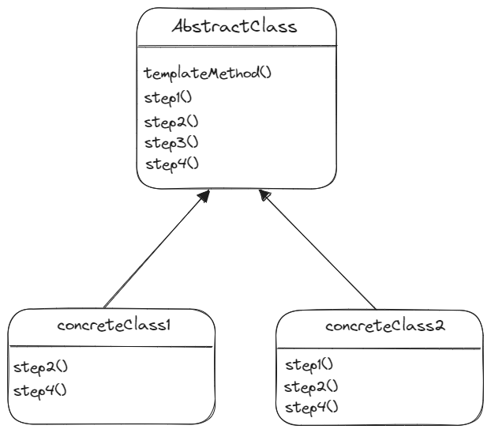

# 템플릿 메소드 패턴 - Template Method Pattern

> **💡 템플릿 메소드 패턴은 알고리즘의 골격을 정의한다. 템플릿 메소드를 사용하면 알고리즘의 일부 단계를 서브클래스에서
> 구현할 수 있으며, 알고리즘의 구조는 그대로 유지하면서 알고리즘의 특정 단계를 서브클래스에서 재정의할 수도 있다.**

## 🔨 템플릿 메소드 구조

* **AbstractClass**
  * AbstractClass 에 템플릿 메서드가 들어있다.
  * abstract 메소드로 선언된 단계(메소드)들이 템플릿 메서드에서 활용된다. 

* **ConcreteClass**
  * ConcreteClass 는 여러 개가 있을 수 있다. 각 클래스는 템플릿 메소드에서 요구하는 모든 단계를 제공해야 한다.
  * abstract 로 선언되었던 단계들은 ConcreteClass 에서 구현한다. `templateMethod()` 는 이런 메소드를 호출해서 작업을 처리한다.

---

## 🎯 템플릿 메소드 패턴 사용 시기
* 클라이언트가 알고리즘의 특정 단계만 확장하고, 전체 알고리즘이나 해당 구조는 확장하지 않도록 할때

* 동일한 기능은 상위 클래스에서 확장하고, 변화가 필요한 부분만 하위 클래스에서 구현할 때

---

## 📝 템플릿 메소드 패턴의 장단점

### 장점
* 클라이언트가 대규모 알고리즘의 특정 부분만 재정의하도록 하여 알고리즘의 다른 부분에 발생하는 변경 사항의 영향을 덜 받도록 한다.
* 상위 추상클래스로 로직을 공통화 하여 코드의 중복을 줄일 수 있다.
* 서브 클래스의 역할을 줄이고 핵심 로직을 상위 클래스에서 관리함으로써 관리가 쉬워진다.

### 단점
* 알고리즘 구조가 복잡할수록 템플릿 로직 형태를 유지하기 어려워진다.
* 추상 메소드가 많아지면서 클래스의 생성, 관리가 어려워질 수 있다.
* 로직에 변화가 생겨 상위 클래스를 수정할 때, 모든 서브 클래스의 수정이 필요 할수도 있다.
---
**_출처_**

[Refactoring Guru](https://refactoring.guru/ko/design-patterns/decorator)

헤드퍼스트 디자인패턴